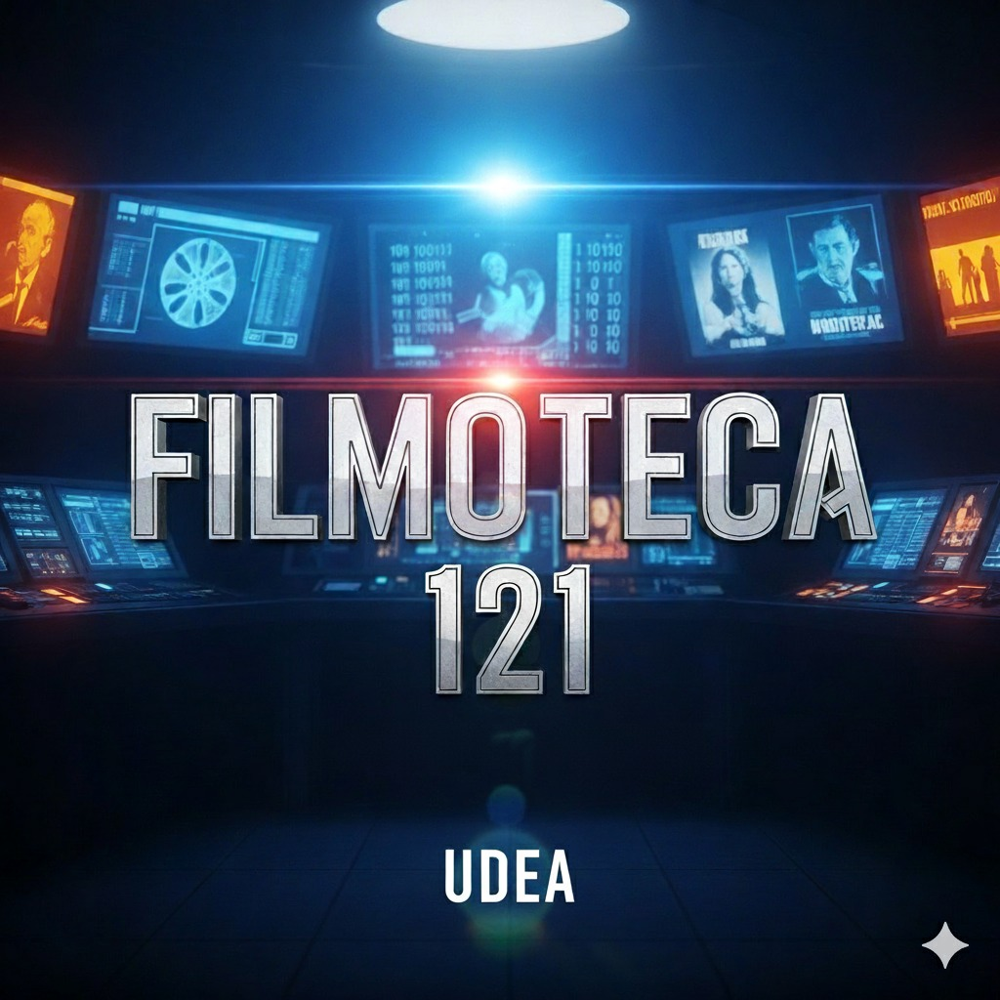

# Filmoteca-121

  

## Descripción
Filmoteca 121 es un proyecto académico de estudiantes de Ingeniería Industrial de la UdeA. Consiste en un programa en Python que automatiza la gestión de un espacio cinematográfico en la ciudadela, permitiendo a estudiantes y personal disfrutar de funciones los fines de semana.

## Integrantes
|            NOMBRE             |     ROL/CARGO EN EL PROYECTO    |
|-------------------------------|---------------------------------|
|Karen Meliza Zapata Gutierrez  | Líder del proyecto y encargada del repositorio en GitHub|
|Yuliana Andrea Quiros Pareja   |Secretaria, encargada de toda la parte documental del proyecto
|Jaider Osorio González | Encargado del soporte tecnico |
|Luisa Fernanda Galeano Serna | Encarga de hacer segumiento a los avances y entregas |

## Vínculos académicos y descripción

- **Karen Meliza Zapata Gutierrez**:
Soy estudiante de Ingeniería Industrial y tengo el gusto de liderar el proyecto Filmoteca-121, además de encargarme del repositorio en GitHub. Me considero organizada, responsable y siempre con disposición para aprender y mejorar cada día. Me apasiona trabajar en equipo y comunicarme de manera clara. Tengo conocimientos en Visual Studio Code, Sublime Text y MongoDB, pero lo que más me motiva es seguir creciendo, aprendiendo nuevas herramientas y aportando al grupo de la mejor manera posible.

- **Yuliana Andrea Quiros Pareja**:
Estudiante de Ingeniería Industrial, actualmente cursando el 4º semestre en la sede Norte. Vivo en el municipio de Angostura. Mis expectativas para este grupo de trabajo son que cada integrante pueda aportar de manera significativa, logrando un flujo de trabajo efectivo y un proyecto de calidad.

- **Jaider Osorio González**:
Estudiante de Ingeniería Industrial en la Universidad de Antioquia, perteneciente a la sede Norte, con 21 años. Me interesa el aprendizaje práctico de la programación y cómo aplicarlo para optimizar procesos, mejorar la gestión de recursos y crear soluciones útiles en la vida universitaria y profesional. Me considero comprometido, organizado y con disposición para trabajar en equipo, aportando tanto al desarrollo técnico como a la coordinación de actividades dentro del proyecto. 

- **Luisa Fernanda Galeano Serna**:
Apasionada por el aprendizaje continuo y estudiante de Ingeniería Industrial. Me considero responsable, disciplinada y con capacidad para trabajar en equipo. Valoro las buenas relaciones interpersonales y procuro actuar siempre con respeto, empatía y consideración hacia los demás.

## Funcionalidades
- Registro y consulta de películas.
- Administración de funciones de fin de semana.
- Registros básicos en consola.

## Presupuesto
El presupuesto del proyecto se medirá en **tiempo de práctica profesional**, no en dinero.    
- Este tiempo es un estimado y puede ajustarse según el avance del proyecto y eventualidades del equipo, garantizando que todos los miembros contribuyan de manera equilibrada.

|     **Integrante**           | **Horas estimadas**|**Actividades principales**|
| -----------------------------|------------------- | --------------------------|
| Karen Meliza Zapata          |     20 horas       |     Diseñar y programar el módulo de consulta de funciones (películas disponibles, horarios y asientos libres |
| Yuliana Andrea Quiros        |     20 horas       | Desarrollar el módulo de registro de usuarios (estudiantes y asistentes del cine) |
| Jaider Osorio González       |     20 horas       |    Desarrollar el módulo de cancelación de reservas y validar la integridad de datos   |
| Luisa Fernanda Galeano Serna |     20 horas       |      Desarrollar el módulo de registro de reservas de películas y entradas       |

## Licencia
Este proyecto está bajo la licencia **CC BY-NC-SA 4.0**.  
Puedes consultar los detalles en el archivo [LICENSE](LICENSE)  
o directamente en [Creative Commons](https://creativecommons.org/licenses/by-nc-sa/4.0/)

## Reporte de visión 
Este software tiene como objetivo gestionar el sistema universitario La Filmoteca-121, ofreciendo una manera organizada de administrar sus 121 asientos y funciones de cine de fin de semana.
Este sistema beneficiará tanto a los usuarios (estudiantes,docentes,administrativos,oficiales internos y público externo),quienes podrán reservar facilmente y obtener su factura, como a los administradores,que tendrán control centralizado sobre las reservas, los ingresos, la generación de reportes estadísticos y la gestión general de la Filmoteca-121. De esta manera, se busca mejorar la organización, reducir errores y ofrecer un experiencia mas ágil y profesional.
El alcance del software incluye: el registro y validación de usuarios, la creación y cancelaón de reservas,la consulta de funciones del fin de semana, la generación de facturas, la obtención de reportes administrativos (ventas,ingresos, usuarios con más o menos reservas), la exportación de resultados a archivos CSV y la interacción mediante un menú en consola que facilita la navegación.

# Diagrama de Gantt - Proyecto Cine

**Periodo:** Semana 6 (6 de octubre) – Noviembre  

| Entregable / Módulo         | Responsable(s)     | Semana 6 (6-12 Oct) | Semana 7 (13-19 Oct) | Semana 8 (20-26 Oct) | Semana 9 (27 Oct-2 Nov) | Semana 10 (3-9 Nov) | Semana 11 (10-16 Nov) | Semana 12 (17-23 Nov) |
|-----------------------------|--------------------|---------------------|----------------------|----------------------|--------------------------|---------------------|-----------------------|-----------------------|
| **Integración de entregables iniciales** | Todos            | ✅                 |                      |                      |                          |                     |                       |                       |
| **Registro de Usuarios**    | Yuliana            |                     | 🔵                   | 🔵                   |                          |                     |                       |                       |
| **Registro de Reservas**    | Luisa              |                     | 🔵                   | 🔵                   |                          |                     |                       |                       |
| **Cancelación de Reservas** | Jaider             |                     |                      | 🔵                   | 🔵                       |                     |                       |                       |
| **Consulta de Funciones**   | Karen              |                     |                      |                      | 🔵                       | 🔵                  |                       |                       |
| **Módulo Administrador**    | Karen              |                     |                      |                      |                          | 🔵                  | 🔵                     |                       |
| **Facturación**             | Todos              |                     |                      |                      |                          |                     | 🔵                     | 🔵                     |
| **Cierre y pruebas finales**| Todos              |                     |                      |                      |                          |                     |                       | 🔵                    |

🔵 = Desarrollo activo  
✅ = Entregable terminado
